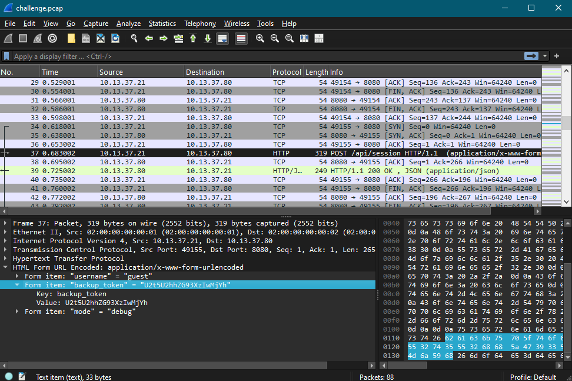
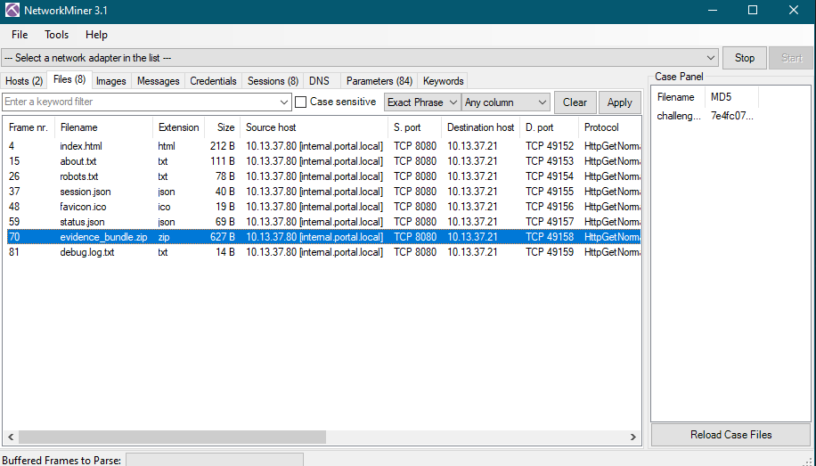
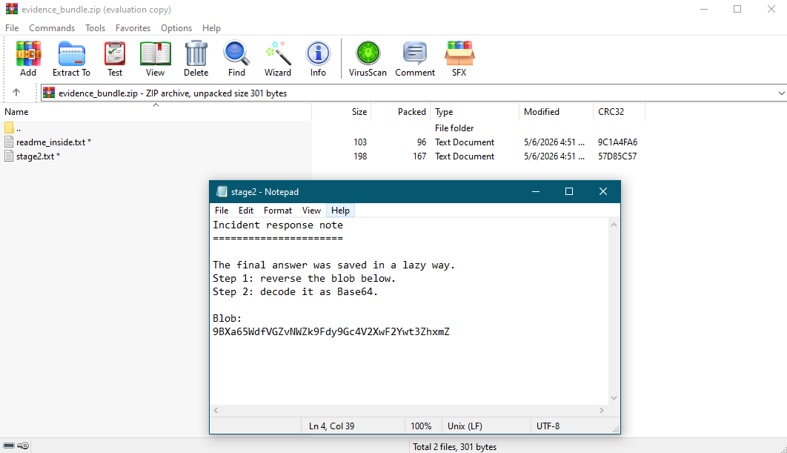

# PCAPass — Challenginno

| Field      | Details                  |
|------------|--------------------------|
| Platform   | Challenginno             |
| Category   | Network Forensics / PCAP |
| Difficulty | Easy–Medium              |
| Tools Used | NetworkMiner, Wireshark  |

---

## Overview

A PCAP file was provided for analysis. Most of the traffic looked normal — standard HTTP requests and typical system activity. With closer inspection, a few things stood out: a session containing a hidden token, an encrypted ZIP file being transferred, and a multi-layer encoded secret hidden inside it.

I used **NetworkMiner** as the primary tool for session and file extraction, which made spotting anomalies much faster than scrolling through raw packets. Wireshark was used for deeper packet-level inspection where needed.

---

## Challenge Breakdown

### Session Token

In NetworkMiner's Sessions view (confirmed in Wireshark), a `POST /api/session` request was visible. The server's response contained a token stored in the session.




---

### ZIP File Password

This was an interesting find. The `POST /api/session` request body contained a field that wasn't immediately obvious:

```
username=guest&backup_token=U2t5U2hhZG93XzIwMjYh&mode=debug
```

The `backup_token` value had the classic signs of Base64 — mixed uppercase, lowercase, and digits, nothing outside the Base64 alphabet.

```python
import base64
base64.b64decode("U2t5U2hhZG93XzIwMjYh").decode()
# → SkyShadow_2026!
```

This was the password for `evidence_bundle.zip`, extracted from packet 71 (`GET /vault/evidence_bundle.zip` response).



**Password:** `SkyShadow_2026!`

---

### Hidden Blob String

After extracting and decrypting the ZIP, it contained two files:

- `readme_inside.txt` — instructions: reverse the blob, then Base64 decode
- `stage2.txt` — the blob value itself

```
9BXa65WdfVGZvNWZk9Fdy9Gc4V2XwF2Ywt3ZhxmZ
```

**Step 1 — Reverse the string:**
```
ZmxhZ3twY2FwX2V4cG9ydF9kZWNvZGVfdW56aXB9
```

**Step 2 — Base64 decode:**
```python
import base64
base64.b64decode("ZmxhZ3twY2FwX2V4cG9ydF9kZWNvZGVfdW56aXB9==").decode()
# → flag{pcap_export_decode_unzip}
```



**Flag:** `flag{pcap_export_decode_unzip}`

---

## Key Takeaways

- Credentials and tokens can be hidden inside HTTP POST request bodies — always check every parameter, not just the obvious ones
- **NetworkMiner** is significantly faster than Wireshark for session overview and file extraction
- A hidden path in `robots.txt` (`/dev/session.log`) pointed to further session data — always check disallowed paths
- Encoded data can have multiple layers — in this case reverse + Base64, instructions were hidden inside the ZIP itself
