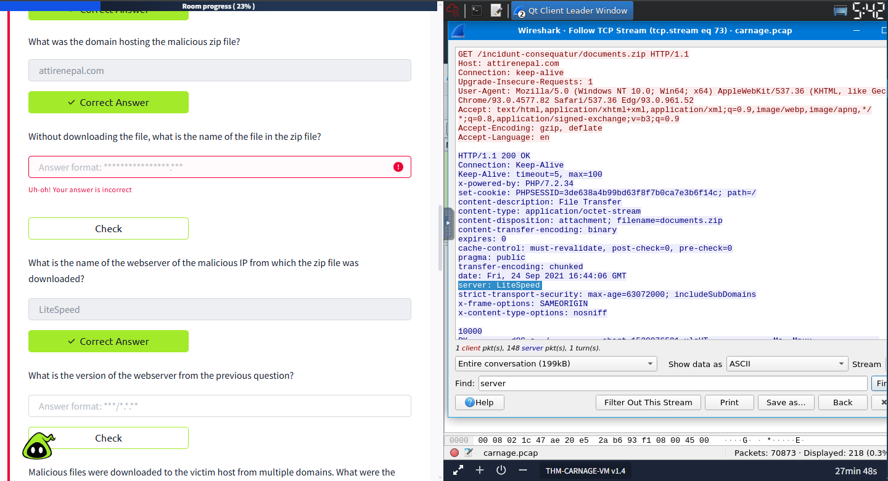
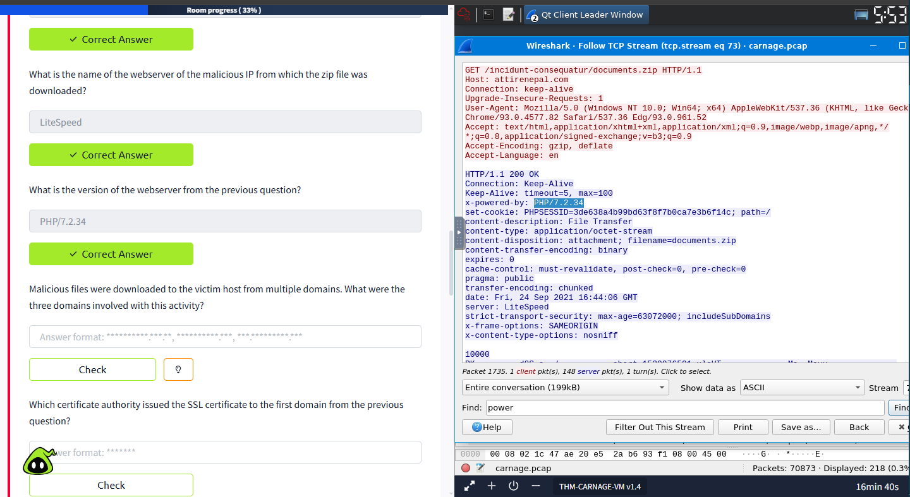
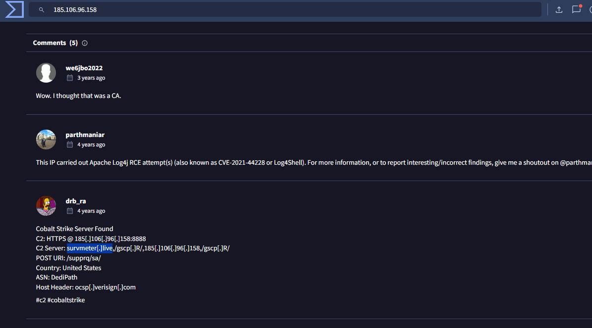
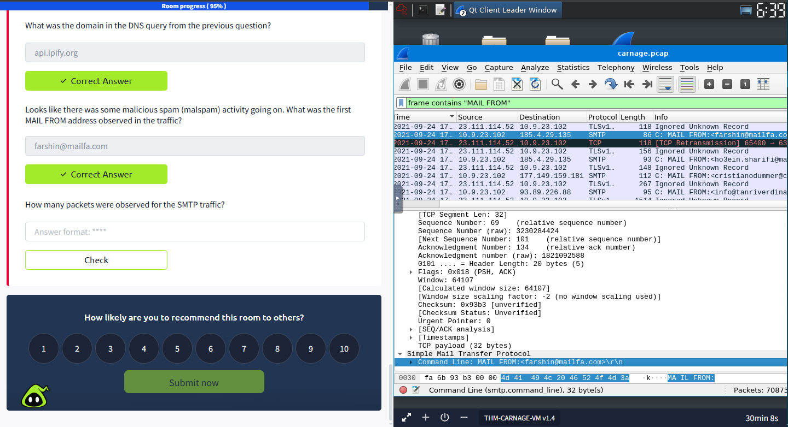

# TryHackMe — Carnage

**Platform:** TryHackMe | **Difficulty:** Medium
**Category:** Network Forensics / PCAP Analysis | **Date:** June 2026

---

## Scenario
Investigate a malicious PCAP to trace a full compromise — from 
initial infection through C2 communication and data exfiltration.
Primary tool: Wireshark.

---

## Attack Summary
A user executed a malicious Excel file that triggered a zip download
containing the actual payload. The malware established C2 via Cobalt 
Strike and exfiltrated data through SMTP.

---

## Key Techniques Learned

**Server identification via TCP Stream**
Instead of guessing, following the TCP stream reveals server name 
and version directly in the HTTP response headers.

**Extracting files from malicious ZIP via Hex view**
When a file isn't easily exportable, the hex view in Wireshark lets 
you inspect raw bytes to identify and extract embedded files.

**C2 identification with VirusTotal**
Took suspicious IPs from the PCAP and looked them up on VirusTotal 
to confirm Cobalt Strike infrastructure.

**SMTP filter for email exfiltration**
`frame contains "MAIL FROM"` isolates SMTP traffic quickly — useful 
for identifying outbound email as an exfiltration channel.

**SSL certificate inspection**
Followed TCP stream at the transport layer to extract SSL certificate 
details — useful for fingerprinting C2 servers that use HTTPS.

---

## Key Takeaway
PCAP analysis is faster when you know where to look: TCP streams for 
protocol details, hex view for embedded files, and VirusTotal for 
rapid IOC validation.
